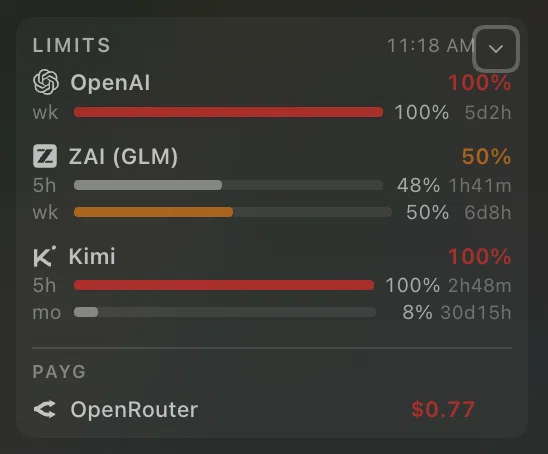

<h1 align="center">dsh-usage-hq</h1>

<p align="center">DeepSeek Harness 插件：在侧边栏显示编程订阅额度与 PAYG 余额 —— <code>@linxin666/dsh-usage</code> 的维护版分支，附带 HQ 额度小组件。</p>

<p align="center">
  <a href="#english">English</a> ·
  <a href="#русский">Русский</a> ·
  <a href="#中文">中文</a>
</p>

<p align="center">
  
  
  
</p>


<p align="center">
  
  &nbsp;&nbsp;
  
</p>

# 中文

## 功能

插件为 DeepSeek Harness 添加：

- **Settings → Usage Statistics** 面板：token 消耗、各提供商余额，以及 Plans 标签页（订阅配额窗口 5 小时 / 周 / 月与重置时间）；
- **侧边栏额度小组件**（本分支的重点）：`LIMITS` 卡片，每个订阅提供商一个层级块 —— 徽标、名称、最大占比、每个窗口一行（5px 进度条、百分比、实时重置倒计时）；下方为调暗的 **PAYG** 块（有实时余额的按量付费提供商），以及折叠后的「徽标 + 最紧百分比」芯片条。

## 与上游的差异

`dsh-usage-hq` 是 [`@linxin666/dsh-usage`](https://github.com/zhu1090093659/dsh-web)（Apache-2.0）的分支。以下改动全部保存在可版本管理的 `src/` 中，而不是对 `node_modules` 的临时补丁：

| # | 改动 |
|---|------|
| 1 | 语言回退反转：非中文界面语言使用英文（上游默认回退到中文） |
| 2 | 提供商徽标：以 `currentColor` 渲染官方标志 —— OpenAI、Z.AI、Kimi、OpenCode Go、MiniMax、DeepSeek、Moonshot、OpenRouter、SiliconFlow；未知提供商显示中性圆点 |
| 3 | 额度小组件最终布局：层级化提供商块（已经维护者确认），取代单行布局 |
| 4 | Kimi 解析器适配新的 `body.usages` API（`limit_5h`、`limit_month_total`、`limit_month_code`）；Kimi 没有周窗口 —— 不会伪造 |
| 5 | 每个窗口百分比旁的重置倒计时（`4h12m`、`6d3h`、`reset`）；`month-code` 窗口只保留在 Plans 标签页 |
| 6 | Codex Lite：API 只报告周窗口 —— 小组件不会伪造 5 小时窗口 |
| 7 | 小组件只显示订阅：当日 token 计数与余额已移出（仍保留在 Settings 中） |
| 8 | PAYG 余额：订阅下方独立的调暗块，$1/$10 颜色阈值（CNY 按 /7.2 换算） |

## 架构

```text
┌──────────────────── DeepSeek Harness ────────────────────┐
│                                                          │
│  ┌─────────────── host (lib/index.js) ────────────────┐  │
│  │ usage ledger · 提供商套餐/余额探测                  │  │
│  │ dsh-usage.* RPC 路由                               │  │
│  └──────────────────────┬─────────────────────────────┘  │
│                          │ overview 快照                  │
│  ┌──────────────────────▼─────────────────────────────┐  │
│  │              client (lib/client.js)                │  │
│  │  UsageFootCard（额度小组件 · PAYG · 芯片条）        │  │
│  │  UsageSectionCard（设置：usage/plans/bank）         │  │
│  └────────────────────────────────────────────────────┘  │
└──────────────────────────────────────────────────────────┘
```

## 快速开始

从源码构建（pnpm ≥ 9，Node ≥ 22）：

```bash
pnpm install
pnpm build     # tsc -p tsconfig.build.json && tsdown → lib/
pnpm test      # vitest，150 个测试
```

安装到 DSH profile（本仓库作者的使用方式）：打包生成 tarball，在 profile 的 `package.json` 中引用它，并把插件行加入 `dsh.profile.bundles` —— 包内的 `cordis.patch.yml`（id `hq-usage`）会自行插入插件行。之后重启 DSH，host 半部分随启动加载。

## 致谢与许可

- 本项目是 [@linxin666/dsh-usage](https://github.com/zhu1090093659/dsh-web) 的分支 —— 全部引擎工作（提供商适配器、host 探测、ledger、i18n、设置界面）属于上游；见 [NOTICE](NOTICE) 与 [LICENSE](LICENSE)（Apache-2.0）。
- [docs/logos](docs/logos) 中的徽标文件是其各自所有者的商标，仅用于提供商身份识别；来源见 [docs/logos/SOURCES.md](docs/logos/SOURCES.md)。
